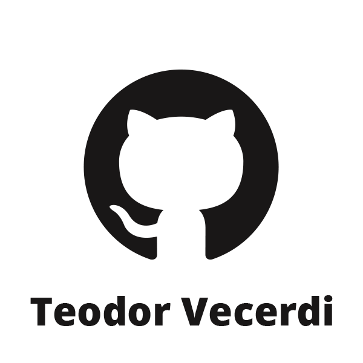

<h2 align="center">About me</h2>

I'm a second year Game Engineering student at Saxion. I'm passionate about tooling / creating editor tools in general, and also about the more technical aspects that go into creating a game.

  
<h2 align="center">You can reach me at</h2>

  
  
  
  
  
  

## Highlights of my past work:

<table align="center">
<tr>
<td align="center">

</td>
<td align="justify">
Developing CodeGraph was my first experience with creating editor tooling and my first time working with the, at the time, buggy and experimental libraries UIElements and GraphView from Unity. 

CodeGraph, while never finished, provided a friendly node-based interface that generates C# classes to be used in Unity.
</td>
</tr>
<tr>
<td align="justify">DialogueGraph was my attempt at learning more about the frameworks I used to implement CodeGraph, as well as learning more about editor tooling, usability and advanced features. I chose to create this editor tool as part of a self-defined learning outcome for one of my courses at Saxion. 

Overall I'm a lot more happier with how this project turned out, both in terms of the tool I created, and in terms of what I learned while creating it.</td>
<td align="center">

</td>
</tr>
<tr>
<td align="center">

</td>
<td align="justify">This course's task was to procedurally generate a city based on a chosen theme (I chose Witcher 3's Novigrad) and my procedural generation approach was full mesh generation. Besides mesh generation I created another tool that would help me place down where buildings should be generated.</td>
</tr>
<tr>
<td align="justify">I was the only engineer in a multi-disciplinary team where we had to develop an app or game that would bring a client's activity into the living room of their target group (during the corona lockdown). We chose to create an app called BarHub where people would create/join rooms in a typical match-making style at different bars througout the city of Enschede where they could talk, play miniganes and listen to music together.

My main tasks were implementing the server that would handle communication and synchronization between clients, and the client itself: a unity game. For the client I worked on programming and UI design.</td>
<td align="center">

</td>
</tr>
<tr>
<td align="center">

</td>
<td align="justify">During this course I learned all about 2D physics by completing different assignments and finishing with a physics-based prototype of a tank game with destructible environment.</td>
</tr>
<tr>
<td align="justify">The task of this course was developing a small turn-based fight game in C++. It was my first experience working with C++ since highschool and a great learning experience. I developed a small "engine" on top of SFML.</td>
<td align="center">

</td>
</tr>
</table>
 

If you like what I do, consider buying me a coffee!
 

 

## Some Github statistics:

<!-- 

